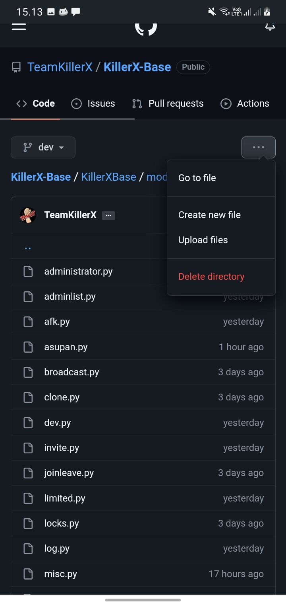

## KillerX-Base


[](https://hub.docker.com/r/rendyprojects/python/tags)


```
️                       ⚠️ WARNING FOR YOU ️ ️⚠️
   KillerXBase is used to help your account activities on Telegram
   We are not responsible for what you misuse in this repository
   !  Be careful when using this repository!
   If one of the members misuses this repository, we are forced to ban you
   Never ever abuse this repository
``` 
## Tutorial Coding Pyrogram
<details> 
<summary>How to create new file</summary>

  - View code 
  - Click 3 dots 
  - Select create new files



- try use `test.py`
```python
import asyncio
from pyrogram import Client as ren
from pyrogram.types import *
from pyrogram import Client
from KillerXBase.helper.basic import *
from KillerXBase.helper.adminHelpers import *
from KillerXBase.helper.cmd import *
from KillerXBase.helper.dev import *
from KillerXBase.helper.misc import *
from KillerXBase.modules.help import *

@ren.on_message(filters.command("test", cmd) & filters.me)
async def test(client: Client, message: Message):
    await asyncio.gather(message.delete(), client.send_message(message.chat.id, "**hello World"*", reply_to_message_id=ReplyCheck(message),),)


add_command_help(
    "test",
    [
        ["test", "Hello World"],
    ],
)
```

</details>

## Deploy On KillerXBase

<details> 
<summary>See Click</summary>

## Heroku

[](https://killerxbase.vercel.app/)

## Cloud Okteto
[](https://cloud.okteto.com/deploy?repository=https://github.com/TeamKillerX/KillerX-Base)

## Railway App
[](https://railway.app/new/template/9Me5Kj?referralCode=NzLfjZ)

## Tutorial VPS
```console
Rendy@Ubuntu~ $ sudo apt update && sudo apt upgrade -y && sudo apt-get install -y curl git npm screen ffmpeg && sudo apt-get install python3-pip -y
Rendy@Ubuntu~ $ git clone https://github.com/TeamKillerX/KillerX-Base && cd KillerX-Base
Rendy@Ubuntu~ $ pip3 install -r req *
Rendy@Ubuntu~ $ cp sample_config.env config.env
Rendy@Ubuntu~ $ nano config.env
Rendy@Ubuntu~ $ screen -S base 
Rendy@Ubuntu~ $ python3 -m KillerXBase

# ctrl a + d 
```

## Heroku Manual Linux
```console
Rendy@Ubuntu~ $ git clone example-app
Rendy@Ubuntu~ $ cd example-app
Rendy@Ubuntu~ $ heroku login
Rendy@Ubuntu~ $ heroku create --region eu appname # create app in eu region, common regions: eu, us
Rendy@Ubuntu~ $ heroku buildpacks:set heroku/python # set python buildpack
Rendy@Ubuntu~ $ git push heroku master # deploy app to heroku
Rendy@Ubuntu~ $ heroku config:set EXAMPLE_BOT=123456789 # set config vars, insert your own
                ...
Rendy@Ubuntu~ $ heroku ps:scale example=1 # start bot dyno
Rendy@Ubuntu~ $ heroku logs --tail # If for some reason it’s not working, check the logs
Rendy@Ubuntu~ $ heroku ps:stop example # stop bot dyno
```

</details> 

## Credits
- [KillerX-Base](https://github.com/TeamKillerX/KillerX-Base)
- [Zaid-Userbot](https://github.com/ITZ-ZAID/ZAID-USERBOT)
- [PyroMan-Userbot](https://github.com/mrismanaziz/PyroMan-Userbot)

## library 
- [Pyrogram](https://github.com/pyrogram)

## Donation

[](https://www.buymeacoffee.com/randydev)
